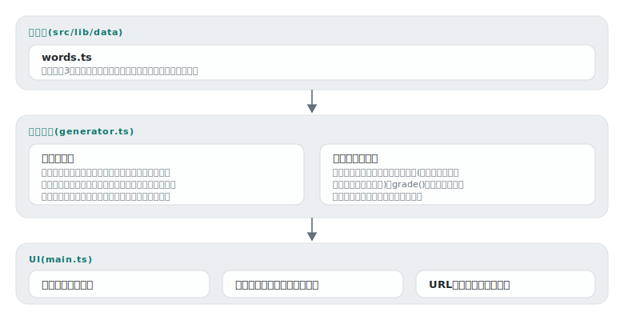

# masume

[](https://github.com/miruky/masume/actions/workflows/ci.yml)
[](https://github.com/miruky/masume/actions/workflows/deploy.yml)
[](https://www.typescriptlang.org/)
[](LICENSE)

**カタカナクロスワードをブラウザ内で自動生成して解く。問題番号(シード)をURLで送ると、相手の画面にも同じ盤面が現れる**

デモ: https://miruky.github.io/masume/

## 概要

masumeは、11×11の盤面にカタカナの語を交差させて配置するクロスワードの生成器と、その出題画面である。「新しい問題」を押すたびに別の盤面が作られ、ヨコのカギ・タテのカギを手がかりにマスを埋めていく。採点ボタンで誤っているマスだけが示され、答えそのものはばらされない。途中経過はlocalStorageに保存され、リロードしても続きから解ける。

盤面はサーバーではなく手元のブラウザで、シード付き乱数から決定的に生成される。URLが `#p=42` なら誰の環境でも同じ盤面になるため、URLを送るだけで同じ問題を競い合える。

生成はクロスワードの基本則に従う。語は必ず既存の語と交差する位置にだけ置かれ、語の前後は黒マスか盤外で閉じ、平行する語が隣り合って偶然の文字列を作ることはルールで禁止している。語数が目標(10語)に届くまで内部で作り直し、最良の盤面を採用する。

### なぜ作ったのか

クロスワードは解くのは楽しいが、作るのは大変で、雑誌の問題は一度解いたら終わりになる。自動生成なら無限に遊べるが、既存の生成器は英語向けが多く、長音「ー」や小書き文字を含むカタカナ語の交差をきちんと扱うものが見当たらなかった。また、生成した問題を「同じ盤面で」人と共有したかったので、サーバー保存ではなくシードをURLに載せる方式にした。

## アーキテクチャ



## 技術スタック

| カテゴリ             | 技術                                 |
| :------------------- | :----------------------------------- |
| 言語                 | TypeScript 5(strict、実行時依存ゼロ) |
| ビルド               | Vite 8                               |
| テスト               | Vitest(node環境)                     |
| リンタ・フォーマッタ | ESLint(typescript-eslint)+ Prettier  |
| CI / 配信            | GitHub Actions / GitHub Pages        |

## 使い方

### 盤面を生成する

```ts
import { generate, words } from './src/lib';

const puzzle = generate(words, 42);
// puzzle.size           => 11
// puzzle.placements     => 16語(シード42の場合)。番号・座標・向き・カギを持つ
// puzzle.placements[0]  => { number: 1, dir: 'across', word: 'テブクロ', ... }
// puzzle.solution       => 11x11の解答。文字マスはカタカナ、黒マスはnull
```

同じシードからは常に同じ盤面ができる。語数が10語に届かない引きの悪い乱数列でも、内部で作り直して最良の盤面を返す。

### 採点する

```ts
import { grade } from './src/lib';

const entries = puzzle.solution.map((row) => row.map(() => ''));
// ...利用者の入力をentriesに反映...
const result = grade(puzzle, entries);
// result.correct / result.total / result.wrong(誤りマスの座標) / result.complete
```

空のマスは「誤り」に数えない。違う文字が入っているマスだけが `wrong` に入る。

## プロジェクト構成

- `src/lib/data/words.ts` カタカナ3文字以上の語彙94語とカギ
- `src/lib/generator.ts` 交差配置の探索・カギ番号づけ・採点
- `src/lib/rng.ts` シード付き乱数(mulberry32)とシャッフル
- `src/lib/kana.ts` ひらがな入力のカタカナ正規化
- `src/main.ts` 盤面・カギ・入力移動・URL共有のUI
- `docs/` アーキテクチャ図

## はじめ方

### 前提条件

- Node.js 22以上

### セットアップ

```bash
git clone https://github.com/miruky/masume.git
cd masume
npm ci
npm run dev
```

### テスト・lint・ビルド

```bash
npm test
npm run lint
npm run build
```

テストは30シードを通して盤面の不変条件(語数・交差の存在・前後の閉塞・番号づけ)を検査する。

### デプロイ

mainへのpushで `deploy.yml` がGitHub Pagesへ公開する。サブパス配信のためのbaseは環境変数 `MASUME_BASE` で渡す。

## 制約

- 語彙は身近な名詞94語に絞っており、解き続けると同じ語に出会う。語彙を増やすには `words.ts` に追記する。
- 生成は貪欲法で、敷き詰め型(黒マス最小)の盤面は作らない。語と語の間に空白の多い、スケルトン型のパズルになる。
- かなの入力はIME経由を想定している。1マスに確定した文字の最後の1文字を採用するため、変換途中の挙動はIMEによって差がある。
- カギの言い回しは大人向けで、難易度調整(子ども向け語彙など)の仕組みはない。

## 設計方針

- **盤面は決定的に作る** — 乱数はすべてシード付きで、シードが盤面の identity になる。これで「問題の共有」がURL1本で済み、テストも再現可能になる。
- **ルールをデータでなく検査関数で持つ** — 交差・閉塞・平行接触の禁止は配置候補の検査関数に集約し、30シードの不変条件テストで生成結果そのものを検査する。
- **誤答の位置だけ教える** — 採点は「どこが違うか」までで、正しい文字は見せない。考える余地を残すための線引きで、降参用には別に「答えを見る」を置く。
- **入力の摩擦を減らす** — ひらがなで打ってもカタカナに正規化し、確定すると次のマスへ進む。向きはマスの再クリックで切り替わる。

## ライセンス

[MIT](LICENSE)
